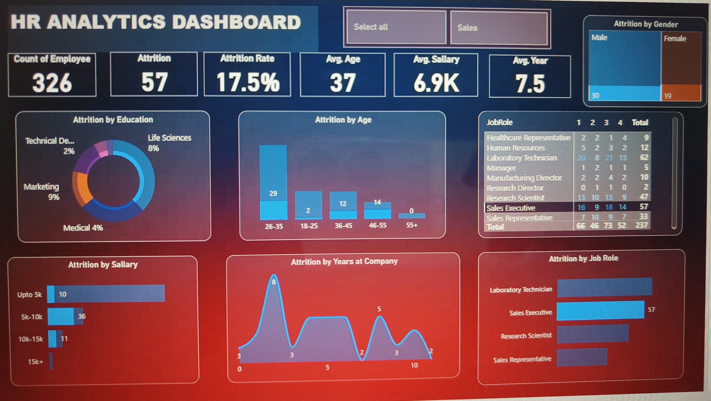

## Project Overview

An interactive Power BI dashboard developed to analyze employee attrition and HR trends.

## Tools Used

- Power BI
- Power Query
- DAX
- Data Modeling
- Data Visualization

## Key Analysis

- Employee attrition analysis
- Attrition by gender
- Attrition by education
- Attrition by age
- Attrition by salary
- Attrition by years at company
- Attrition by job role

## Key Metrics

- Total Employees: 1470
- Total Attrition: 237
- Attrition Rate: 16.1%
- Average Age: 37
- Average Salary: 6.5K
- Average Years at Company: 7.0

## Dashboard

